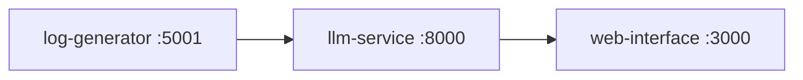

# LLM Log Explainer

Three Docker services: generate realistic app logs, classify/explain them, show both on a small dashboard.

**Owners:** [Aaditya Upadhyay](https://github.com/Addy48) (Docker, generator, infra) · Rasagya Vatsal (LLM service, training)

<p align="center">
  
  
  
</p>

---

## Architecture



| Service | Role |
|---------|------|
| `log-generator` | Flask. Random logs + five failure scenarios |
| `llm-service` | FastAPI. `/explain`, `/explain-batch`, `/fetch-and-explain` |
| `web-interface` | Static dashboard |

Live `/explain` uses **scenario templates** in `llm-service/prompts.py`. DistilBERT training + `evaluate.py` live in `llm-service/` for the classifier track. Weights are Git LFS (`*.safetensors`) — optional, not required to bring the stack up.

---

## Quick start

```bash
git clone https://github.com/Addy48/llm-log-explainer.git
cd llm-log-explainer
docker compose up --build
```

Skip LFS if you only want the API:

```bash
GIT_LFS_SKIP_SMUDGE=1 git clone https://github.com/Addy48/llm-log-explainer.git
```

| URL | Service |
|-----|---------|
| http://localhost:5001 | Log generator |
| http://localhost:8000 | LLM service (`/docs`) |
| http://localhost:3000 | Dashboard |

---

## API (short)

**POST /explain**

```json
{ "timestamp": "2026-02-01T10:30:00Z", "level": "ERROR", "message": "Connection timeout to database" }
```

Contract: [API-CONTRACT.md](API-CONTRACT.md)

Generator also exposes `/generate`, `/generate/batch`, `/scenario/<name>` (`database_failure`, `auth_breach`, `memory_leak`, `api_overload`, `disk_failure`).

---

## Train (optional)

```bash
cd llm-service
pip install -r requirements.txt
python prepare_data.py
python train.py
python evaluate.py
```

---

## Layout

```
log-generator/     Flask app
llm-service/       FastAPI + train/eval
web-interface/     dashboard
docker-compose.yml
```
